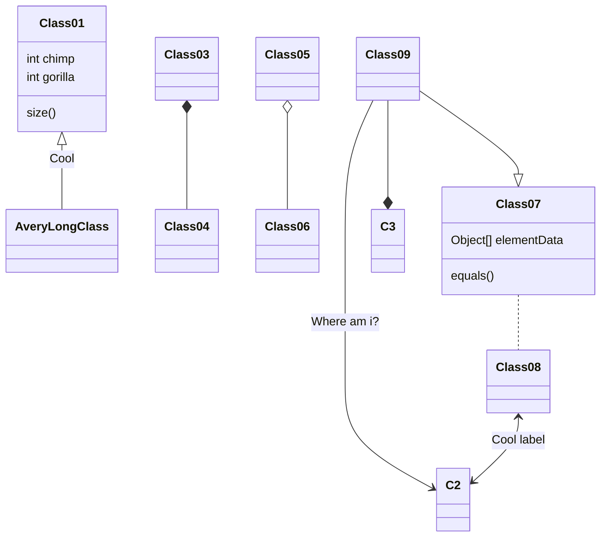

&emsp;&emsp;Hexo博客技能树汇总，在本篇文章中将会汇总本网站支持的各种功能，包括动态图表生成和 $\LaTeX$ 公式表示。

<!--more-->

# 绘制动态图表

基于插件 `hexo-tag-chart` 实现数据图表可视化。

```shell
npm i hexo-tag-chart -S
```

{% chart 90% 300 %}
    {
    type: 'line',
    data: {
    labels: ['January', 'February', 'March', 'April', 'May', 'June', 'July'],
    datasets: [{
        label: 'My First dataset',
        backgroundColor: 'rgb(255, 99, 132)',
        borderColor: 'rgb(255, 99, 132)',
        data: [0, 10, 5, 2, 20, 30, 45]
        }]
    },
    options: {
        responsive: true,
        title: {
        display: true,
        text: 'Chart.js Line Chart'
        }
    }
}


<br/>

上面这个样例可以通过以下代码来实现：

```js
{% chart 90% 300 %}
    {
    type: 'line',
    data: {
    labels: ['January', 'February', 'March', 'April', 'May', 'June', 'July'],
    datasets: [{
        label: 'My First dataset',
        backgroundColor: 'rgb(255, 99, 132)',
        borderColor: 'rgb(255, 99, 132)',
        data: [0, 10, 5, 2, 20, 30, 45]
        }]
    },
    options: {
        responsive: true,
        title: {
        display: true,
        text: 'Chart.js Line Chart'
        }
    }
}

```


<br/><br/>


# 支持 LaTeX 数学公式

本博客平台使用 `hexo-renderer-markdown-it-katex` 插件实现 Markdown 中 $\LaTeX$ 公式的渲染。安装方式需要先卸载之前的 Markdown 渲染器，然后替换成新的 Katex 渲染器插件。

```shell
npm un hexo-renderer-marked -S && npm i hexo-renderer-markdown-it-katex -S
```

$$
\left[\begin{array}{lll}
    a_{11} & a_{12} & a_{13} \\
    a_{21} & a_{22} & a_{23} \\
    a_{31} & a_{32} & a_{33}
    \end{array}\right] .*\left[\begin{array}{lll}
    b_{11} & b_{12} & b_{13} \\
    b_{21} & b_{22} & b_{23} \\
    b_{31} & b_{32} & b_{33}
    \end{array}\right]=\left[\begin{array}{lll}
    a_{11} b_{11} & a_{12} b_{12} & a_{13} b_{13} \\
    a_{21} b_{21} & a_{22} b_{22} & a_{23} b_{23} \\
    a_{31} b_{31} & a_{32} b_{32} & a_{33} b_{33}
\end{array}\right]
$$

<br/>

上面这个样例可以通过以下代码来实现：

```latex
$$
\left[\begin{array}{lll}
    a_{11} & a_{12} & a_{13} \\
    a_{21} & a_{22} & a_{23} \\
    a_{31} & a_{32} & a_{33}
    \end{array}\right] .*\left[\begin{array}{lll}
    b_{11} & b_{12} & b_{13} \\
    b_{21} & b_{22} & b_{23} \\
    b_{31} & b_{32} & b_{33}
    \end{array}\right]=\left[\begin{array}{lll}
    a_{11} b_{11} & a_{12} b_{12} & a_{13} b_{13} \\
    a_{21} b_{21} & a_{22} b_{22} & a_{23} b_{23} \\
    a_{31} b_{31} & a_{32} b_{32} & a_{33} b_{33}
\end{array}\right]
$$
```


<br/><br/>

# 支持 Mermaid 流程图

Mermaid 流程图是一款基于 JavaScript 的强大图表和绘图工具，它以其独特的魅力在数据可视化领域脱颖而出。这款工具允许用户通过受 Markdown 启发的简洁文本定义来动态创建和修改图表，为用户提供了极大的便利性和灵活性。




<br/>

上面这个样例可以通过以下代码来实现：
```
classDiagram
Class01 <|-- AveryLongClass : Cool
Class03 *-- Class04
Class05 o-- Class06
Class07 .. Class08
Class09 --> C2 : Where am i?
Class09 --* C3
Class09 --|> Class07
Class07 : equals()
Class07 : Object[] elementData
Class01 : size()
Class01 : int chimp
Class01 : int gorilla
Class08 <--> C2: Cool label
```

更多的 Mermaid 使用方式可以参考：[https://mermaid.js.org/intro/](https://mermaid.js.org/intro/)


<br/><br/>


# 置顶或隐藏文章

本博客网站中采用 `hexo-generator-index-custom` 插件进行博客文章的置顶和隐藏操作。

**置顶文章**，在文章标题栏增加 `top` 关键字，其值可以是 `true` 或数字，数字越大，文章排在越前面：

```
top: 100
```

**隐藏文章**，在文章标题栏增加 `hide` 关键字：

```
hide: true
```


<br/><br/>

# 优化提升访问效率


本博客网站中采用 `hexo-neat` 插件优化提升访问效率。


<br/><br/><br/><br/>
